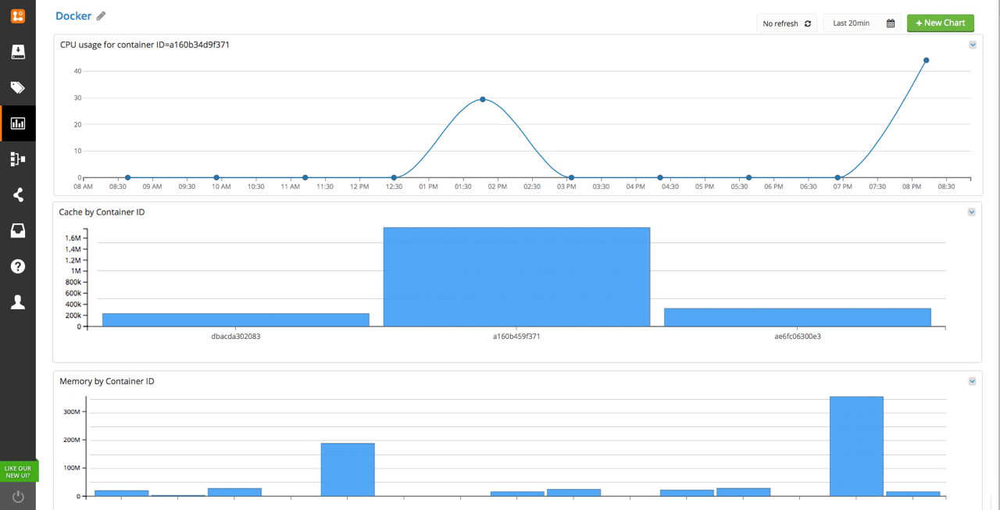

# docker-logentries

Forward all your logs to [LogEntries](logentries.com), like a breeze.



See the Logentries community pack at [http://revelops.com/community/packs/docker/](http://revelops.com/community/packs/docker/).

## Usage as a Container

The simplest way to forward all your container's log to LogEntries is to
run this repository as a container, with:

```sh
docker run -v /var/run/docker.sock:/var/run/docker.sock logentries -t <TOKEN> -j -a host=`uname -n`
```

You can also pass the `--no-stats` flag if you do not want stats to be
published to logentries every second. You __need this flag for Docker
version < 1.5__.

## Usage as a CLI

1. `npm install docker-logentries -g`
2. `docker-logentries -t TOKEN -a host=\`uname -n\``
3. ..there is no step 3

You can also pass the `-j` switch if you log in JSON format, like
[bunyan](http://npm.im/bunyan).
You can also pass the `--no-stats` flag if you do not want stats to be
published to logentries every second.
The `-a/--add` flag allows to add fixed values to the data being
published. This follows the format 'name=value'.

## Embedded usage

Install it with: `npm install docker-logentries --save`

Then, in your JS file:

```
var logentries = require('docker-logentries')({
  json: false, // or true to parse lines as JSON
  secure: false, // or true to connect securely
  token: process.env.TOKEN, // logentries TOKEN
  stats: true, // disable stats if false
  add: null, // an object whose properties will be added
})

// logentries is the source stream with all the
// log lines

setTimeout(function() {
  logentries.destroy()
}, 5000)
```

## Building a docker repo from this repository

First clone this repository, then:

```bash
docker build -t logentries .
docker run -v /var/run/docker.sock:/var/run/docker.sock logentries -t <TOKEN> -j -a host=`uname -n`
```

## License

MIT
